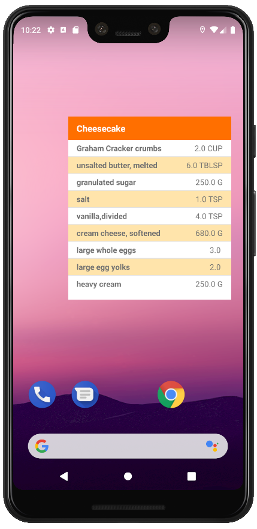

# Baking Time Project

## Project Overview
In Project 4 of the Udacity Android Developer Nanodegree Program, **Baking Time** app was developed to allow Udacity's resident baker-in-chief, Miriam, to 
share her recipes with the world.

This project tests:
- Using MediaPlayer/ExoPlayer to display videos.
- Handling error cases in Android.
- Adding a widget to app experience.
- Leveraging a third-party library.
- Using Fragments to create a responsive design that works on phones and tablets.

## Features

1) Look up recipes
2) Select a recipe and see video-guided steps for how to complete it.

## Room for Improvement
- Offline support for storing recipes
- Marking recipes as favorites with the ability to look them up

## ScreenShots

### Phone
 

### Tablet
 

## Libraries
* [Picasso](https://github.com/square/picasso)
* [ButterKnife](https://github.com/JakeWharton/butterknife)
* [Retrofit](https://square.github.io/retrofit/)
* [ExoPlayer](https://github.com/google/ExoPlayer)
* [Material Components](https://github.com/material-components/material-components-android)
